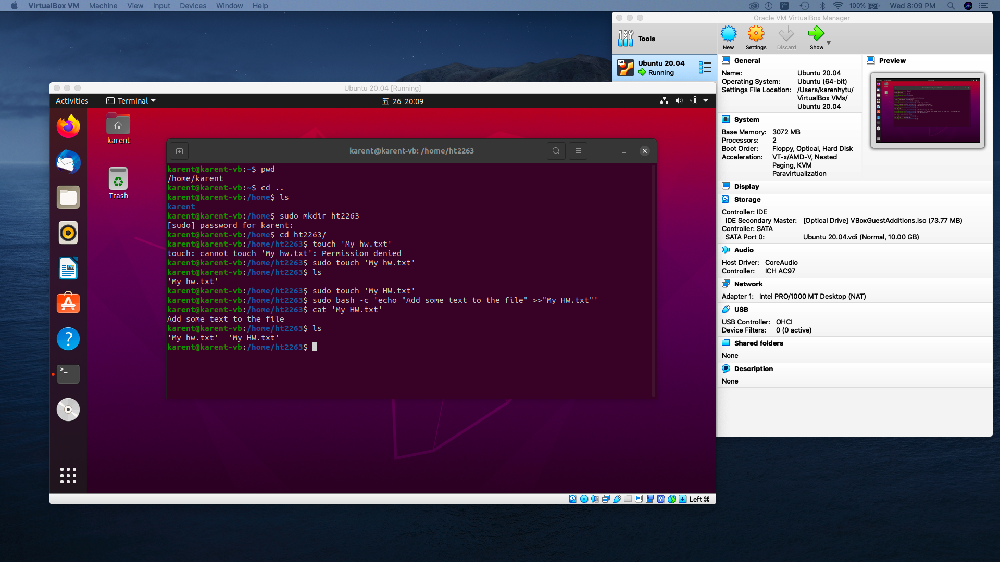

## Agenda 
This week we’re continuing our discussion on Operation systems and introducing concepts of Processes and Threads.

So this week you should:
 

- Watch the video BEFORE THURSDAY!
- Read Tannenbaums Operating Systems Chapter 2.
- Join our Thursday webinar (Thursday 8:00 pm).

## Objective
By the end of the week, students should:

- Understand What is a process, how, when and why one gets created
- Recognize the difference between processes and threads
- be able to identify where, in the operating system characteristics of each are going to be found.

## Assignment

For this homework, I would like you to get a little experience with Linux.  To do this, you will need a computer capable of running virtualbox or another Virtual machine environment.  Download the latest VirtualBox software, it's free and download the ISO of Ubuntu's latest LTS operating system.

Create a virtual machine and install Ubuntu.  You can use whatever settings you'd like.  After creating the system, play with the various settings for CPU, RAM and hardware.  Obviously, this doesn't change the hardware in YOUR machine, but in the virtual machine environment that you are creating.  Settle on 2 CPUs and, at least 2GB of RAM.

You can explore the Ubuntu GUI, but that's not really where the benefits of Linux lie.  I'd like you to get used to the Command Line Interface (CLI).  Open a terminal window and explore how to move (cd, ls, etc) through the file system.  Create a directory in your home directory (~) with your netid (mine would be: dkb238), Edit a file called "My HW.txt" and add some text to it.  List all the files in your directory and take a scrtoeenshot of your terminal window, inside your Ubuntu VitrualBox console, inside your host operating system (Windows or MacOS).

Since most of this is trial and error, the only thing I'm asking you to submit for this assignment is the above screen shot.  Yep, easiest homework so far but after so many weeks of hard homework, maybe its time for an easy one.

